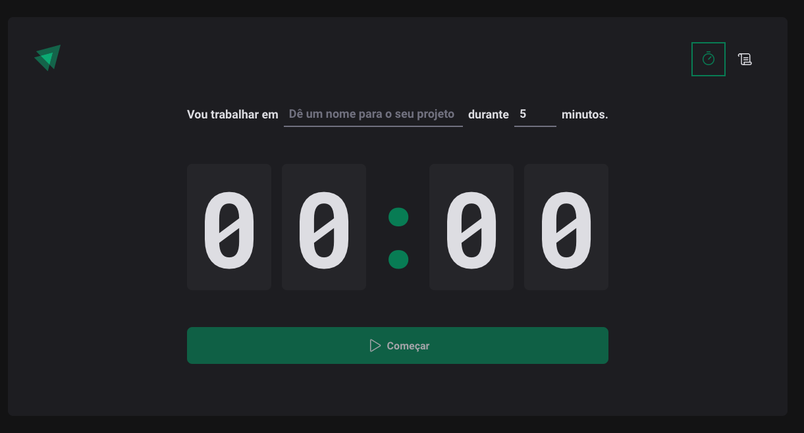

Aplicação implementando a técnica de Pomodoro usando React e Vite

## Configuraçõs Iniciais

Apenas clonar o repositório e realizar o install das dependências e rodar, detalhes abaixo:

## Scripts disponíveis

Para rodar o projeto basta executar

### `npm install`

Para instalar todas as dependências de pacotes do NPM

### `npm run dev`

Roda a aplicação em modo de desenvolvimento. 
Abra [http://localhost:5173](http://localhost:5173) para ver o projeto no browser.

## Fundamentos

Neste projeto foram colocados em prática os conhecimentos:

- Styled Components;
- Typescript;
- Hooks;
- Reducer;
- Local Storage;
- Context API;
- Vite